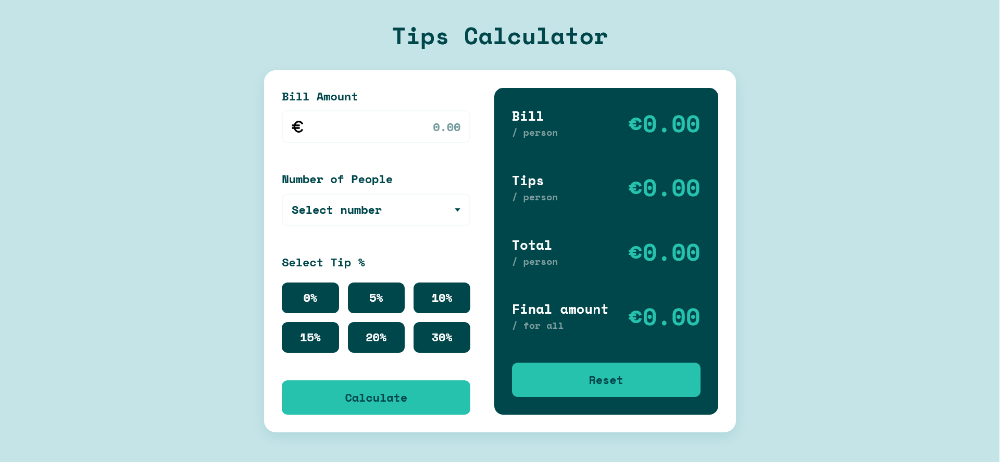

# Tips Calculator Page

The page was created as part of the [Front End Developer Course by Orange DC](https://digitalcenter.orange.md/).

## Table of contents
- [Screenshot](#screenshot)
- [Links](#links)
- [Tasks](#tasks)
- [Tips Calculator Page Description](#tips-calculator-page-description)
- [Author](#author)

## Screenshot

## Links

[Tips Calculator Page](https://github.com/AxinitM/ODC-Tips-Calculator)

## Tasks
Create a Tips Calculator Page. 

## Tips Calculator Page Description
The Tip Calculator helps calculate tips for a group of up to 10 people (consumers). After entering the bill amount (maximum of 99999.99), the number of customers (from 1 to 10), and selecting the tip percentage (from 0% to 30%), the user clicks the Calculate button and sees the following information:
- the part of bill amount per person;
- the tip amount per person;
- the total payment per person (bill + tip);
- the total amount to be received by the waiter (total bill + tip).

The Reset button clears all values and resets the calculator.

If any required information (bill amount, tip percentage, or number of people) is missing, an error message appears indicating the missing data. This message is displayed below the relevant field. The error message disappears when the cursor is moved over the empty field.

## Author

[Andrei Martinenko](https://github.com/AxinitM)
